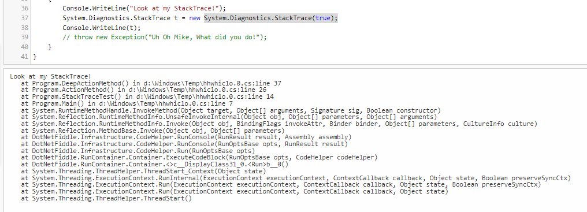

# Stack-Trace

## What is Stack Trace?
* Also called a BACKTRACE, consists of a collection of stacked records, which store an application's movement of functions/method calls during its execution. 
* The stack trace includes information about program subroutines and can be used to debug or troubleshoot.
* Generates when your application crashes because of an error or an exception.
* Often used to create log files.

## Helpful Tips, Best Practices, & Knowledge 
* Read stacks as Most Recent to Oldest
  * The deepest exception happens in yourfunction/method calls and then a chain of exceptions is generated/thrown until the surface exception, which is the last one that happened in time. But when reading the stack we see it in the first place.
* Fun Analogy: Stack of Blocks
  * Think of Stack Trace as if you are building a tower out of blocks.
* Main goal is to locate the Root Cause of your exception.   
* 
* You can obtain a stack trace from System.Diagnostics if you want to see the stack without an exception. 
   * System.Diagnostics.StackTrace(true);
   * 

* Technically, once a block of memory has been allocated on the stack, it cannot be easily removed as there can be other blocks of memory that were allocated before it. Each time a function is called in a program, a block of memory called an activation record is allocated on top of the call stack. Generally, the activation record stores the function's arguments and local variables
* 
   * What's different about this one is the "Caused by". Sometimes exceptions will have multiple "Caused by" sections. For these, you typically want to find the "root cause", which will be one of the lowest "Caused by" sections in the stack trace.
   * 
* a list of Exceptions( or you can say a list of "Cause by")
   *
* A tricky and important thing here need to be understand is : the deepest cause may not be the "root cause", because if you write some "bad code", it may cause some exception underneath which is deeper than its layer. For example, a bad sql query may cause SQLServerException connection reset in the bottem instead of syndax error, which may just in the middle of the stack.

## Stace Trace Small Demo & Examples
* Demo on Fiddle - [Dotnetfiddle](https://dotnetfiddle.net/)
* Splunk Log Examples 
  * [ProcessFlowAutomation Request BusinessLayer](https://git.rockfin.com/Servicing/process-flow-automation-api/blob/main/ProcessFlowAutomationApi.BusinessLayer/RequestBusinessLayer.cs#L12)

## Possible Upgrade/Opportunity
* Ben.Demystifier
  * [Nick Chapsas Video](https://www.youtube.com/watch?v=JcnucGEaxLo&t=1s)
