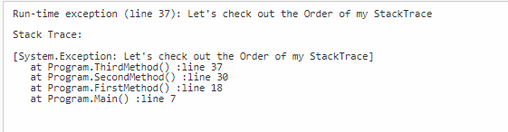

# Stack-Trace

## What is Stack Trace?
* Also called a BACKTRACE, consists of a collection of stacked records, which store an application's movement of functions/method calls during its execution. 
* The stack trace includes information about program subroutines and can be used to debug or troubleshoot.
* Generates when your application crashes because of an error or an exception.
* Often used to create log files.

## Knowledge & Helpful Tips
* Read Stacks as Most Recent to Oldest going from top to bottom 
* Fun Analogy: Stack of Blocks
  * Think of Stack Trace as if you are building a tower out of blocks.
  * 
  * Demo Showing Stack Trace Order - [Dotnetfiddle](https://dotnetfiddle.net/)
* Main goal is to locate the Root Cause of your exception.
  * The root cause may not always be the deepest exception   
  * A lot of times we have an exception in the deepest or first function/method call and then a chain of exceptions is generated or thrown until the surface exception, which is the last one that we see happened. And when reading the stack we see it first in line.
  * Demo Showing Root Cause - [Dotnetfiddle](https://dotnetfiddle.net/)
  
* You can obtain a stack trace from System.Diagnostics if you want to see the stack without an exception. 
   * System.Diagnostics.StackTrace(true);
   * 

* Each time a function is called in a program, a block of memory called an activation record is allocated on top of the call stack. Once a block of memory has been allocated on the stack, it cannot be easily removed as there can be other blocks of memory that were allocated before it.  Generally, the activation record stores the function's arguments and local variables

## Our Own Example
* Splunk Log Example 
  * RMS Payments API
    * Error Post One-Time Payment - Unavailable Draft Date
  * 
  * [Servicing Payments API OneTimePaymentsDataLayer](https://git.rockfin.com/myql-servicing/servicing-payments-api/blob/master_v2/Payments.DataLayer/OneTimePaymentsDataLayer.cs#L98-L103)
  * [Viper API OneTimePaymentsBusinessLayer](https://git.rockfin.com/Servicing/viper/blob/f5e10a5e6f37cee3f741b942c13f0ab6c061db15/Viper.BusinessLayer/OneTimePaymentBusinessLayer.cs#L351-L354)

## Possible Upgrade/Opportunity
* Ben.Demystifier
  * [Nick Chapsas Video](https://www.youtube.com/watch?v=JcnucGEaxLo&t=1s)
